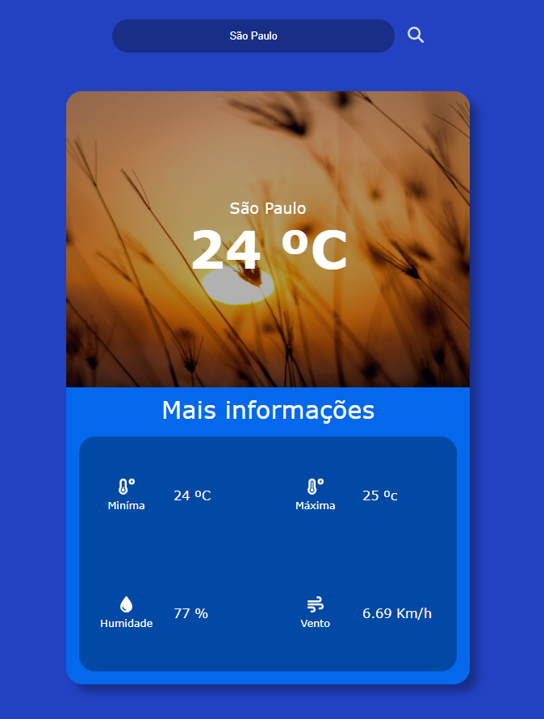

# Weather App

Este é um sistema desenvolvido em Angular 15 que consulta a temperatura de uma cidade utilizando uma API externa. A aplicação é acompanhada Node.js versão 16 para auxiliar.

---

## Tecnologias Utilizadas

- **Frontend:** Angular 15 / Node.js 16
---

## Funcionalidades

- Consulta de temperatura de qualquer cidade através de uma API externa.
- Interface amigável e responsiva.

---

## Pré-requisitos

Antes de começar, você precisará ter as seguintes ferramentas instaladas em sua máquina:

- [Node.js](https://nodejs.org/en/) (versão 16 ou superior)
- [Angular CLI](https://angular.io/cli) (versão compatível com Angular 15)
- [Git](https://git-scm.com/)

---

## Instalação e Execução

Siga os passos abaixo para clonar e executar a aplicação:

1. **Clone o repositório:**
```bash
   git clone https://github.com/Emersonfarias93/weather-app.git
```

2. Navegue até o diretório do projeto:
```bash
    cd weather-app
```

3. Instale as dependências do frontend:
```bash
    npm install
```

# Execute a aplicação Angular:

Navegue de volta para o diretório do frontend:
```bash
  ng serve
```



Após a execução, abra o navegador e acesse http://localhost:4200.


Configuração da API
Certifique-se de configurar a URL da API de temperatura no arquivo de ambiente apropriado para que a aplicação possa consumir corretamente os dados externos.

Contribuição
Para contribuir com este projeto, por favor, siga estas etapas:

Faça um fork do projeto
Crie uma branch para sua feature (git checkout -b feature/MinhaFeature)
Commite suas mudanças (git commit -m 'Add minha feature')
Faça o push para a branch (git push origin feature/MinhaFeature)
Abra um Pull Request

Contato
Se você tiver alguma dúvida ou sugestão, sinta-se à vontade para entrar em contato.

Autor: Emerson Farias
Email: e.fariassantos@gmail.com

Nota: Lembre-se de verificar as permissões de API e de atualizar as chaves de acesso conforme necessário para acessar os dados de temperatura.